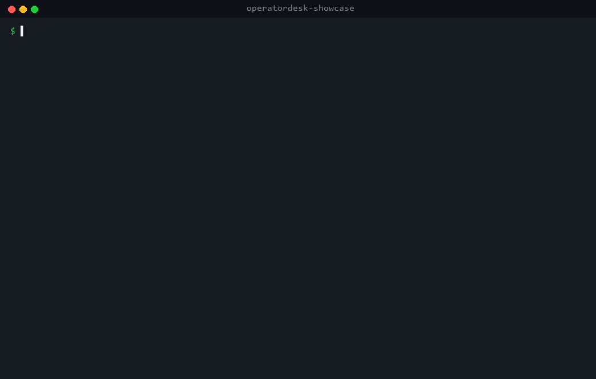
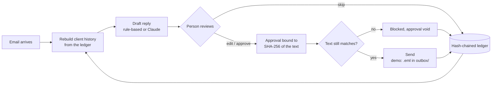

# OperatorDesk showcase

**Email drafting where nothing goes out without a person's approval, and every approved reply becomes the agent's memory for that client.**



This is a small, runnable sample of the pattern I build for client desks (bookkeepers, law and accounting firms, property managers, brokerages). It runs on an invented inbox with no API key, in about two minutes.

## What it shows

**1. An approval gate that can't be sidestepped.** A draft is only a draft. Approving it records the reviewer's name and the SHA-256 of the exact text they saw. If anything changes after that, even one number, the send is refused and the approval is void. In the demo, a price is edited from $300 to $250 after approval, and the gate blocks it until a person re-approves the new version.

**2. The log is the memory.** Every sent reply is recorded per client: what they asked, what we promised, what we asked them for, what they sent. The next draft for that client is written against that history, so the desk doesn't contradict itself or re-ask for things.

| Email | Without memory | With memory |
|---|---|---|
| "Do you still need our August statements?" | "Yes please, send your bank statements." | "No need, we received them on Sep 14." |
| "Any update on the HST?" (a week after we promised one) | "I'll confirm where it stands by Fri Sep 25." A second promise, no mention of the first. | "On Sep 14 I said I'd confirm by Fri Sep 18, and I'm late with it." Then the actual status. |
| Client sends 2 of the 3 forms we asked for | "Thanks, that's everything we need." (It isn't.) | "That covers 2 of the 3 items I asked for on Sep 15. Still needed: SIN and start date." |

Only approved, sent replies become memory. A skipped draft's promises are never recorded as made.

**3. A ledger you can check.** Every step (received, drafted, edited, approved, blocked, sent) is one line in an append-only, hash-chained JSONL file. Editing or deleting any earlier line breaks the chain, and `verify` names the entry.

## Run it

Python 3.10 or newer, no dependencies.

```bash
git clone https://github.com/BLON333/operatordesk-showcase
cd operatordesk-showcase

python -m operatordesk demo          # the full sample inbox, end to end
python -m operatordesk compare e06   # same email drafted with and without memory
python -m operatordesk run           # review each draft yourself: approve, edit or skip
python -m operatordesk verify        # check the ledger's hash chain
python -m operatordesk history kestrel-landscaping
```

To draft with Claude instead of the built-in stand-in, set `ANTHROPIC_API_KEY` (optionally `OPERATORDESK_MODEL`) and add `--claude`. Claude gets the same client history and returns the same structured draft. It still can't send anything.

Tests: `pip install pytest && pytest -q`

## How it works



## Guarantees and limits

- **It never sends real email.** "Send" writes an `.eml` file to `outbox/` with the approver and draft hash in its headers. In a client build this step becomes an Outlook or Gmail send, behind the same gate.
- **Memory is rebuilt from the ledger every time.** There's no second store that can drift from what actually went out.
- **The hash chain catches edits and deletions anywhere before the last entry.** Silently chopping entries off the end needs an outside anchor: the demo prints the head hash so you can pin it somewhere else.
- **The built-in drafter is a stand-in.** It uses simple rules so the demo is deterministic and free to run. Real builds use Claude with the same contract.
- **All data is invented.** Every business, person and address in `data/sample_inbox.json` is fictional.

## Layout

| Path | What it does |
|---|---|
| `operatordesk/ledger.py` | Append-only, hash-chained event log with `verify()` |
| `operatordesk/memory.py` | Rebuilds each client's history (promises, requests, documents) from the ledger |
| `operatordesk/drafting.py` | Rule-based stand-in and Claude drafter, same interface |
| `operatordesk/gate.py` | Approval bound to the draft's hash; `send()` refuses anything else |
| `operatordesk/desk.py` | Wires inbox, memory, drafting, gate and ledger together |
| `operatordesk/cli.py` | `demo`, `compare`, `run`, `verify`, `history` |
| `tests/` | Gate, ledger and memory behaviour, plus the Claude drafter contract |

## About

Built by Jason B. as a public sample of the approval-gated desk automation I build for clients. A longer walkthrough of a document workflow built on the same principles, with its evidence ledger, is [here](https://claude.ai/artifact/U45M7w3e7EGMeRzEZRFyYc). I take on projects through [Upwork](https://www.upwork.com/freelancers/~0188908dd31f18b432).

MIT licensed.
